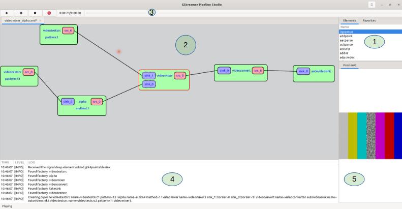

## GstPipelineStudio

As it's not always convenient to use the powerful command line based, `gst-launch` tool and also manage all the debug possibilities on all the platforms supported by GStreamer,
I started this personal project in 2021 to facilitate the adoption to the GStreamer framework and help newbies as confirmed engineers enjoy the power of it.

Indeed a few other projects, such as [Pipeviz](https://github.com/virinext/pipeviz) (greatly inspired from...) or [gst-debugger](https://gitlab.gnome.org/GNOME/gst-debugger), already tried to offer this GUI capability,
my idea with GPS was to provide a cross-platform tool written in Rust with the powerful framework, gtk-rs.

The aim of this project is to provide the GUI for GStreamer but also being able to remote debug existing pipeline while offering
a very simple and accessible interface as back in the days I discovered DirectShow with the help of [graphedit](https://learn.microsoft.com/en-us/windows/win32/directshow/using-graphedit) or [GraphStudioNext](https://www.videohelp.com/software/GraphStudio)

## Project details

The interface includes 5 important zones:
 - (1) The registry area gives you an access to the GStreamer registry including all the plugins/elements available on your system. It provides
 you details on each elements. You can also access to a favorite list.
  - (2) the main drawing area is where you can add elements from the registry area and connect them together. This area
  allows you to have multiple independent pipelines with its own player for each drawing area.
  - (3) The control playback area, each pipeline can be controlled from this area including basic play/stop/pause but also a seekbar.
  - (4) the debug zone where you'll receive the messages from the application.
  - (5) The render zone where you can have a video preview if a video sink has been added to the pipeline. Future work includes to have tracers or audio analysis in this zone.

The project has been written in Rust to offer more stability and thanks to the wonderful work to use the GTK framework, it
was perfectly fitting to this project as it gives an easy way to use it over the 3 platforms targeted such as GNU/Linux, MacOS and
Windows.
On this last platform which is quite well "implanted" in the desktop eco-system, the use of GStreamer
can lead to difficulties, that's why [GstPipelineStudio Windows MSI](https://gitlab.freedesktop.org/dabrain34/GstPipelineStudio/uploads/ce4b8443e2d3161eeaed089071cdc402/GstPipelineStudio-0.3.4.msi) will be a perfect match to test the power of the GStreamer framework.

This project has been written under the GPL v3 License.

## How it works under the hood

The trick is quite simple as it uses the power of [gst-parse-launch API](https://gstreamer.freedesktop.org/documentation/gstreamer/gstparse.html?gi-language=c#gst_parse_launch) to build a pipeline as a transformation of the visual pipeline to a command line.

So its a clearly a sibling of `gst-launch`.

Right now its directly linked to the GStreamer installed on your system but future work could be to connect it over daemons
such as [GstPrinceOfParser](https://github.com/dabrain34/gpop)
or [gstd](https://developer.ridgerun.com/wiki/index.php/GStreamer_Daemon)

## What's new in [0.3.4](https://gitlab.freedesktop.org/dabrain34/GstPipelineStudio/-/releases)

The main feature of this release is the cross platform ready state. These are beta versions but the CI is now ready
to build and deploy Flathub (Linux), Mac OS and Windows version of GstPipelineStudio.

You can download the installers from the project [page](https://dabrain34.pages.freedesktop.org/GstPipelineStudio/) or with:

  - Linux: `flatpak install org.freedesktop.dabrain34.GstPipelineStudio`
  - MacOS: [DMG file](https://gitlab.freedesktop.org/dabrain34/GstPipelineStudio/uploads/5ac641779cfb7e8fffdf9be6a61fba17/GstPipelineStudio-0.3.4.dmg)
  - Windows: [MSI file](https://gitlab.freedesktop.org/dabrain34/GstPipelineStudio/uploads/ce4b8443e2d3161eeaed089071cdc402/GstPipelineStudio-0.3.4.msi)

Here is a list of main features added to the app:

 - Open a pipeline from the command line and it will be drawn automatically on the screen. This feature
allows you to take any command line pipeline and draw it on the screen to allow any new play tricks with the pipeline, such as change of elements, properties etc.

 - Multiple graphview allows you to draw multiple independent pipeline in the same instance of GstPipelineStudio.
The playback state is totally independent for each of the views.

 - Capsfilter has been added to the links allowing to add this crucial feature of GStreamer pipelines.

 - gstreamer-1.0 wrap support to the build system. So you can
 build your own version of GPS using a dedicated GStreamer version.

## What's next in the pipeline

Among multiple use case, key and debug features, the most upcoming features are:

 - Support the zoom on the graphview. As a pipeline can be quite big, the zoom is a key/must features for GPS. See [MR](https://gitlab.freedesktop.org/dabrain34/GstPipelineStudio/-/merge_requests/53)
 - Debug sections such as receiving events/tags/messages or tracers and terminal support, see [MR](https://gitlab.freedesktop.org/dabrain34/GstPipelineStudio/-/merge_requests/55)
 - Elements compatibility to check if an element can connect to the previous/next one.
 - Remote debugging: A tracer wsserver is currently under development allowing to send over websocket the pipeline events such as connections, properties or element addition.
A [MR](https://gitlab.freedesktop.org/dabrain34/GstPipelineStudio/-/merge_requests/52) is under development to connect this tracer and render the corresponding pipeline.
 - Auto plugging according to the rank of each compatible elements for a given pad caps.
 - Display the audio signal in a dedicated render tab.
 - Translations
 - Documentation
 - Unit tests

Here is a [lighning talk](https://gstconf.ubicast.tv/videos/gstpipelinestudio-version-030-is-out/), I gave about this release (0.3.3), during the 2023 GStreamer conference.

Hope you'll enjoy this tool and please feel free to provide
new features with an RFC [here](https://gitlab.freedesktop.org/dabrain34/GstPipelineStudio/-/issues/new) or merge requests [here](https://gitlab.freedesktop.org/dabrain34/GstPipelineStudio/-/merge_requests).

As usual, if you would like to learn more about GstPipelineStudio, GStreamer or any other open multimedia framework, please contact [us](https://www.igalia.com/)!
